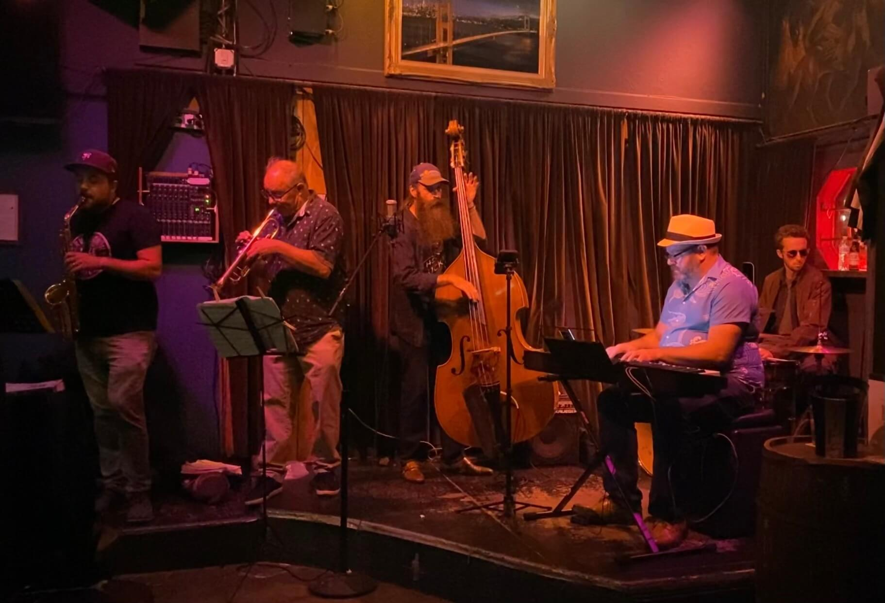

  <h2>The Dirty Works Jazz Band</h2>

This is a group I run with a collection of players. We play gigs and host jams around SF. The core players are Jonathan (piano), Eli Kemp (drums), &  Dan Dectis (alto sax). Several other players often play with us including Peter Ild (trumpet), Richard Caceres (piano), Zack Sanders (Guitar), Stu Silverman (Guitar), & more.

  
<router-link to="/music">Gigs & Jams Calendar</router-link>

  <h2>Recordings</h2>
  
Here are a few live recordings of the Dirty Works Jazz Band.

  
Not professional recordings. Made with an iPhone sitting somewhere nearby.

  <media-player :tracks="this.$parent.dw_tracks"></media-player>

