

  <h2>The Dirty Works Jazz Band</h2>

  

    

Dirty Works is a jazz group I formed a few years ago when I started running jazz jams. This group includes an ongoing mix of Bay Area players. We have some standing members and keep a rolling cast of characters in the group to keep it fresh or handle things when someone is out of pocket.

Dirty Works plays a wide mix of songs rooted in swing, bebop, hard-bop, soul, funk, latin, etc. Often we play as a trio or quartet but expand or shrink to fit the gig.

<h3>Regular Gigs & Jams</h3>

| Every Monday Night
|-
| Dirty Works Open Jazz Jam
| <a href="https://www.waystonesf.com" target="new">Waystone</a>
| North Beach - SF, CA
| 6 - 9 PM

| First Tuesday
|-
| Dirty Works
| <a href="https://www.waystonesf.com" target="new">Waystone</a>
| North Beach - SF, CA
| 6 - 9 PM

| Every Thursday - Early Show
|-
| Dirty Works & Friends
| Invite Jam
| <a href="https://www.persona-sf.com" target="new">Persona</a>
| SF, CA
| 8 - 11 PM

| Every Thursday - Late Show
|-
| Dirty Works w/ Zack Sanders
| Open Jam - Advanced Players
| <a href="https://www.persona-sf.com" target="new">Persona</a>
| SF, CA
| 11:30 - 1:30 AM

| 3rd, 4th, & 5th Wed.
|-
| Dirty Works Jazz Jam
| Open Jam - All Levels
| <a href="https://www.theluckyhorseshoebar.com/" target="Shoe">The Lucky Horseshoe</a>
| Bernal Heights - SF, CA
| 8 - 11 PM

  

    <h3>
      <router-link to="/music#calendar">View Gigs & Jams Calendar</router-link></h3>
  

<h2>What is a Dirty Works Jazz Jam?</h2>

For those not familiar with the traditions of jazz jams here's the low down on how I run things. At a Dirty Works Jam there will always be a rhythym section with bass, keys or guitar, and drums. Depending on the jam we might have a horn player or two out in front of the rhythym section. Sometimes we run without a set drummer and just have drums for someone to sit in. If we have a guitar and no keys then we have a keyboard on set so keyboard playing jammers can play. At the jam the Dirty Works Jazz Band is the House Band, the bass player is in charge, and we welcome jammers to join us.

Our jams have on average a dozen players & singers. We try to keep it pretty loose and have a good time. I don't make people sign up on any lists or divide up players into pre-defined groups and assign a song for them to play. That's not how we roll at all. What we do is after a song or two (not a whole set) we invite players that are there for the jam to join us. 

I try to keep no more than three horn players per song. The expectation is if you jump up then you should know the tune or you have a chart and/or changes ready to read for soloing. We all solo during songs. Call tunes on the fly, take requests from the crowd, and swap out players all night. I make sure every player that comes to a jam gets in on the action for at least one song. We typically go for 3 hours with breaks and finish with a big closer featuring anyone that wants to join in.

We have close to 100 local players come through our jams each month and we play hundreds of jazz standards. New faces are always showing up and have a great crew of regulars. I enjoy shooting phtos now and then when there's another bass player to jump on for me. Below are some photos from the jams. Most photos taken by me, Kyle Finley, and are not authorized for use. More photos can be found on the <a href="https://pixelfed.social/i/web/profile/791341701221125553" target="pixelfed">Dirty Works Jazz PixelFed</a>

More photos can be found on the  <router-link to="/photos/jazz-jams">Jam Photos Page.

Please contact <a href="mailto:Kyle@KyleFinley.net">Kyle Finley</a> to inquire about use of all photos.

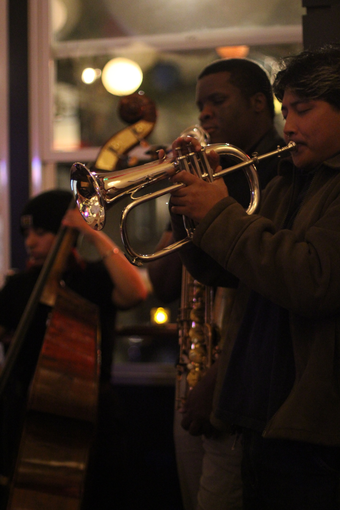

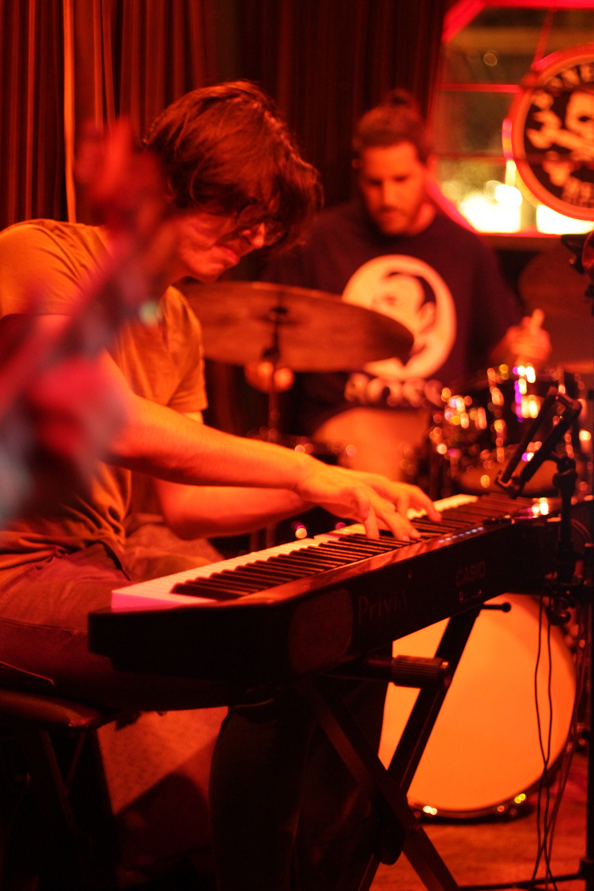

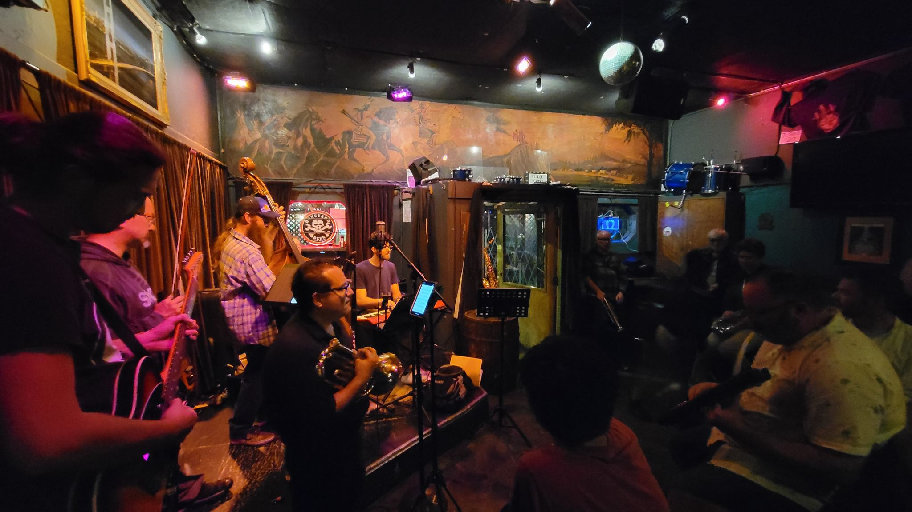

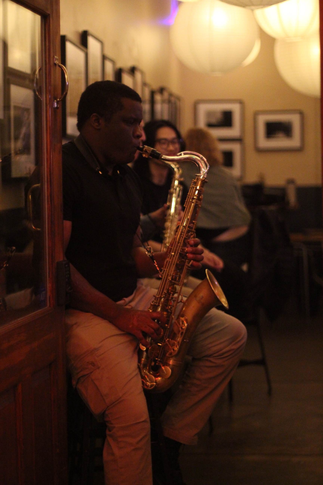

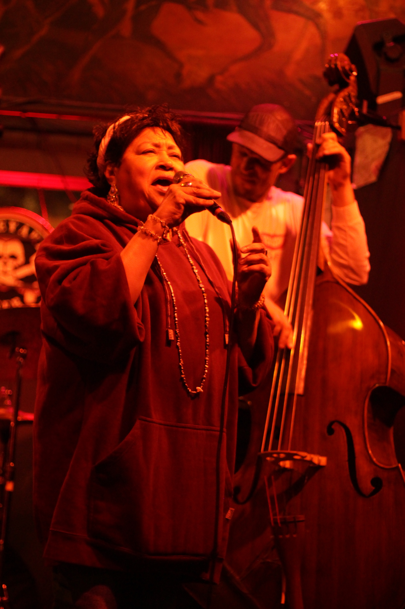

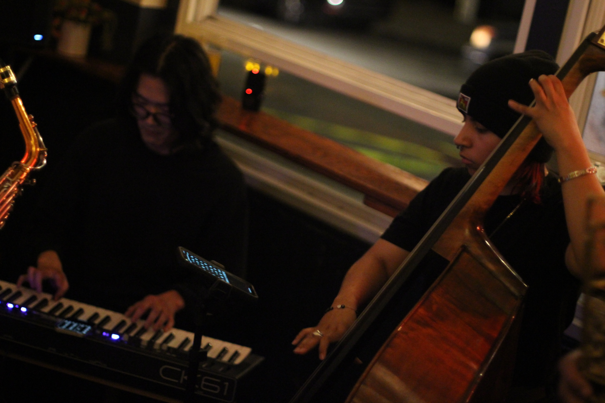

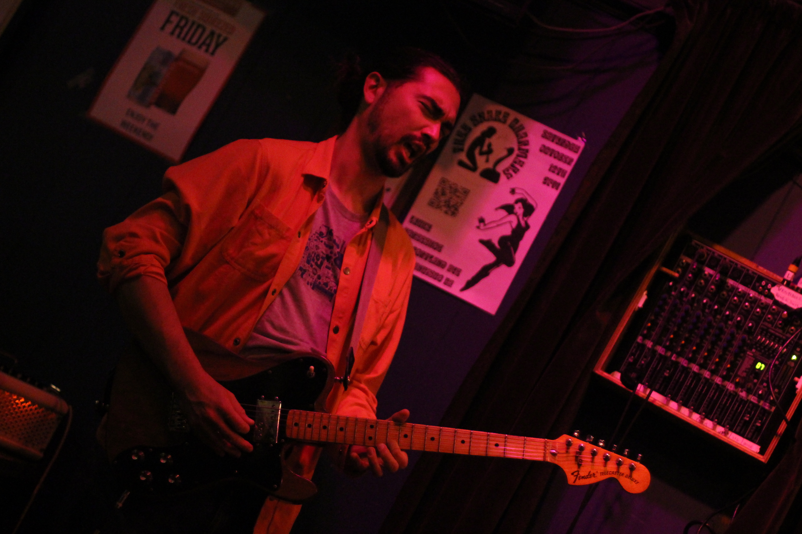

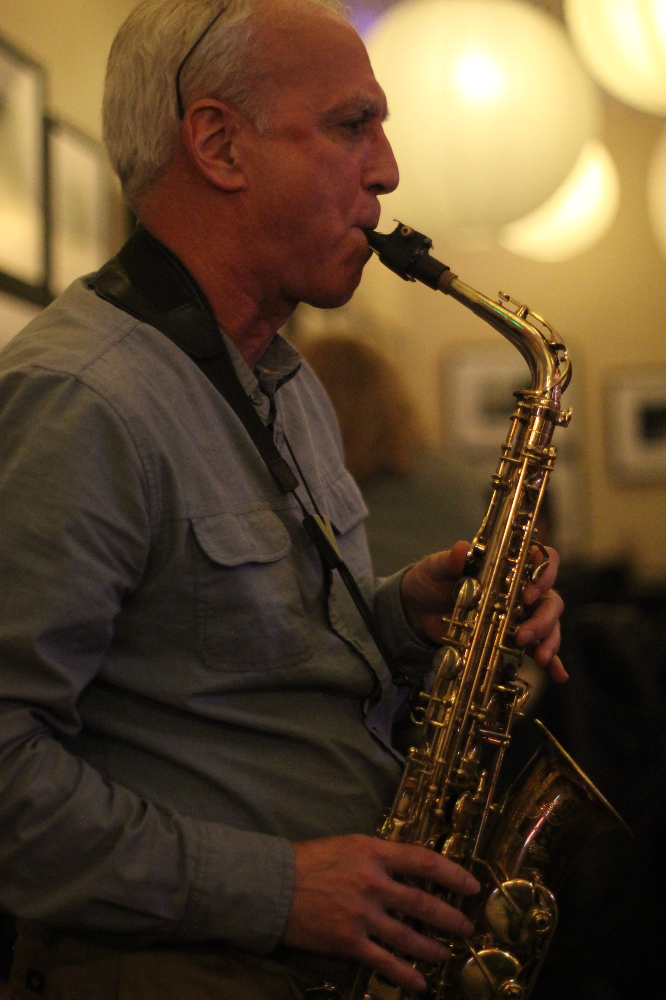

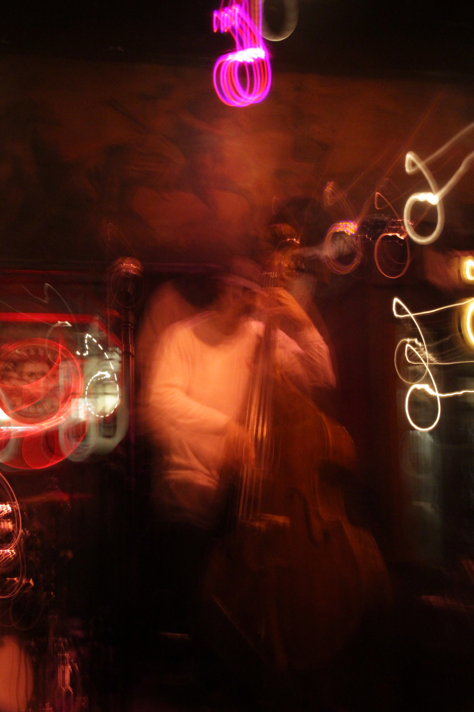

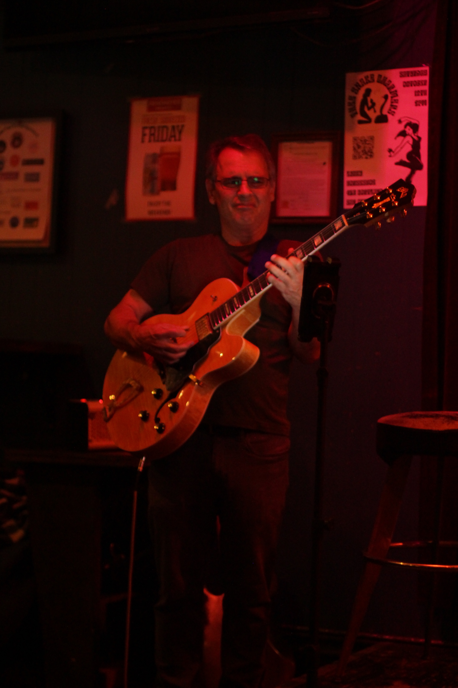

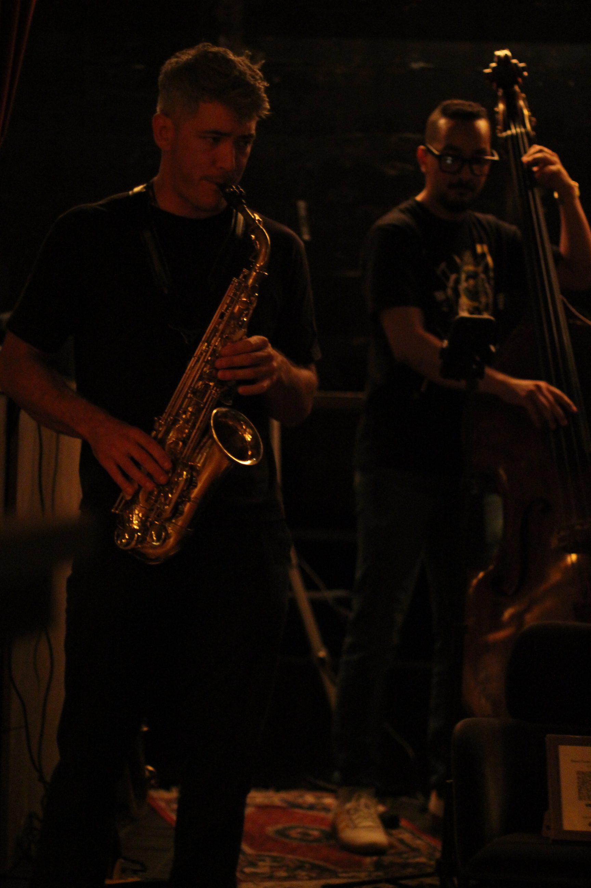

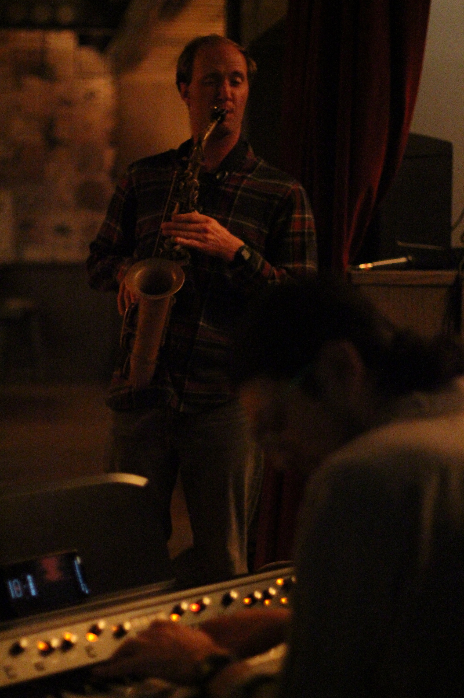

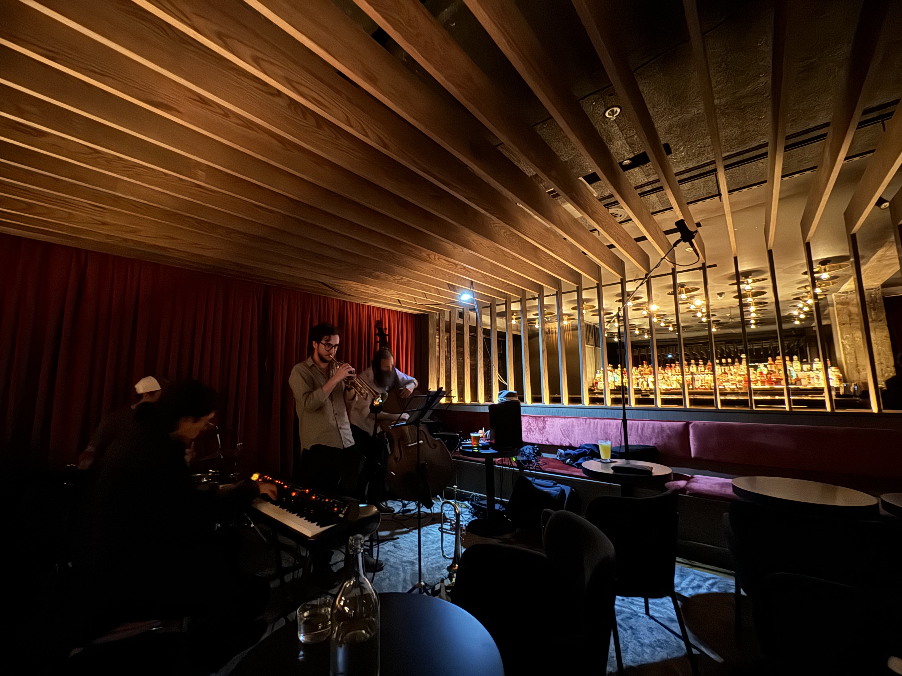

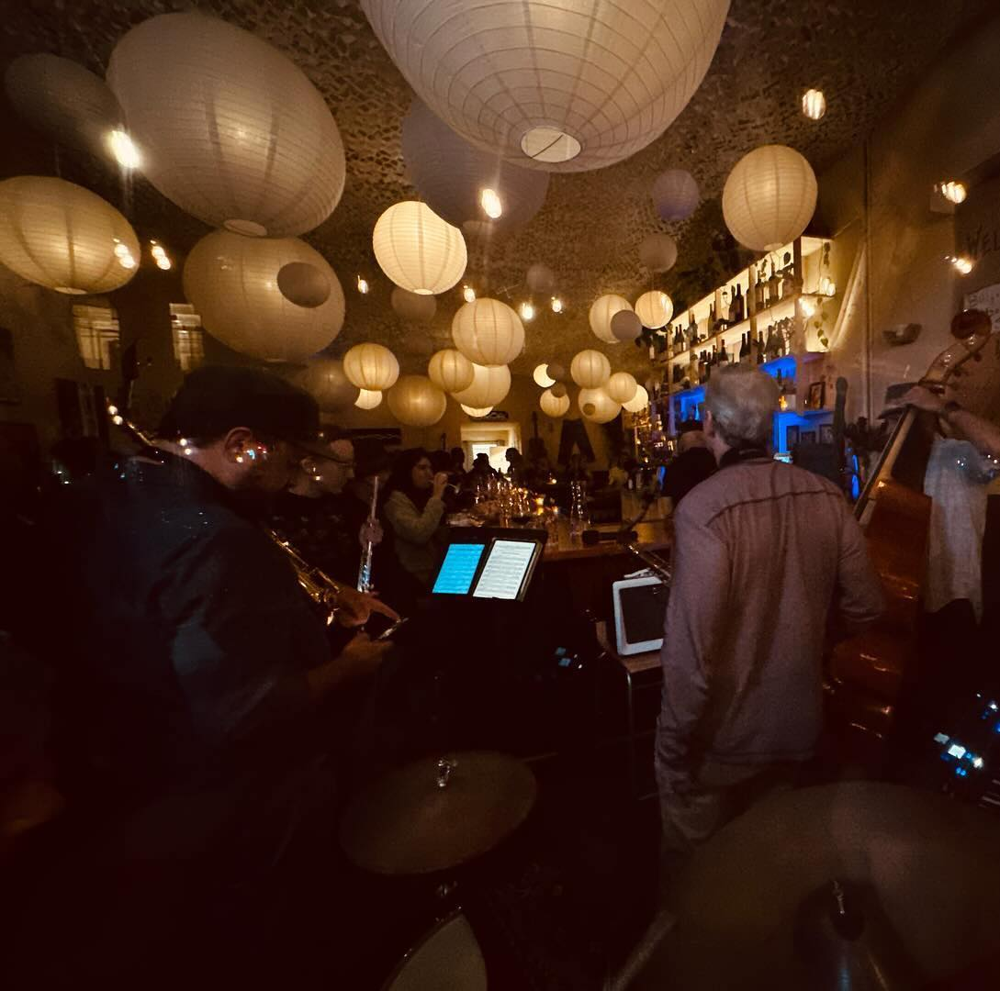

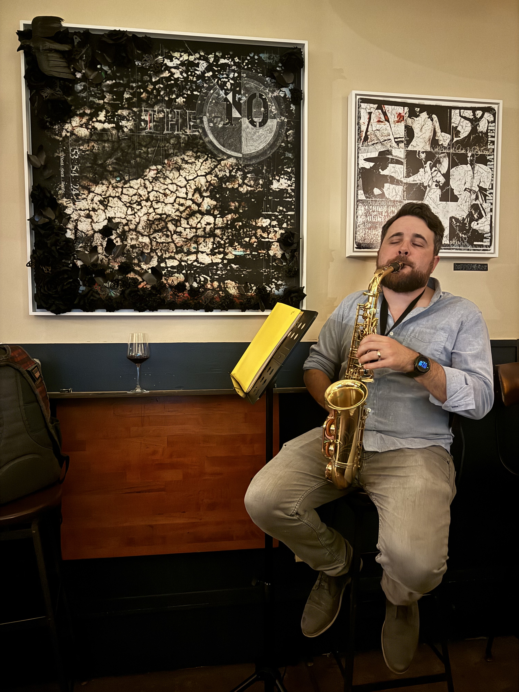

<!-- 

  <h2>Recordings</h2>
  
Here are a few live recordings of the Dirty Works Jazz Band.

  
Not professional recordings. Made with an iPhone sitting somewhere nearby.

  <media-player :tracks="this.$parent.dw_tracks"></media-player>

 -->
