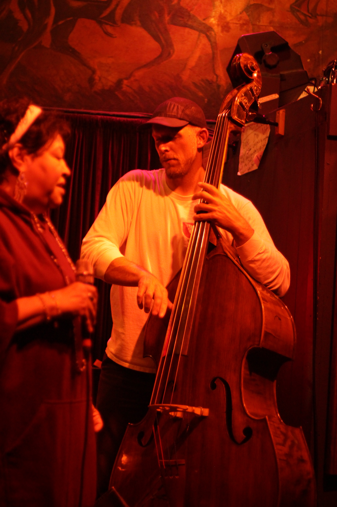

  <h2>The Dirty Works Jazz Band</h2>

This is a group I run that includes a mix of SF and Bay Area players. We play a wide mix of swing, bop, soul, funk, latin, etc. We perform in several configurations but often as a trio or quartet.

We're currently playing gigs and host jams in San Francisco. Every Monday and Tuesday nights we're at Waystone. Monday is an open jam and Tuesday night is a small group. Thursday nights we're in Union Square at Persona for an 8-11 invite jam followed by an open jam from 11:30 to 1:30am. We're also in Bernal Heights every 3rd, 4th, and (sometimes) 5th Wednesday nights at the Lucky Horseshoe from 8-11. This is an open jam and also our longest running jam.

The core players in this group are myself on bass and depending on the gig and player availability on keys, Jonathan Venker or Richard Caceres. On horn, Dan Dectis or Richard Batelaan on sax / Peter Ild or Austin Paton on Trumpet. On drums, Eric Jacobson, Eli Kemp, Théo Auclair, Diego Kiner, or Tim Shea. And Daniel Dickison or Zack Sanders on guitar.

When I'm out of town I'm grateful to have Paul Yago or Connor Law fill in on bass. We're also fortunate to have a long list of great musicians we can pull from to fill gigs or mix things up. We've met most of these players at our weekly jams. This not only helps with booking gigs but it lets us give younger and new players on the scene a chance to get out and play.

  
<router-link to="/music">Gigs & Jams Calendar</router-link>

<!-- 

  <h2>Recordings</h2>
  
Here are a few live recordings of the Dirty Works Jazz Band.

  
Not professional recordings. Made with an iPhone sitting somewhere nearby.

  <media-player :tracks="this.$parent.dw_tracks"></media-player>

 -->
