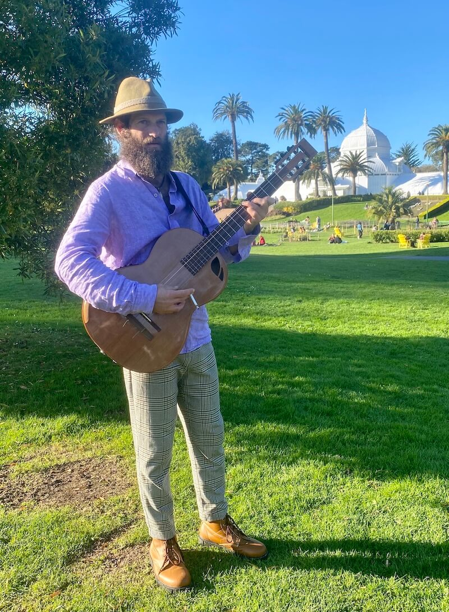
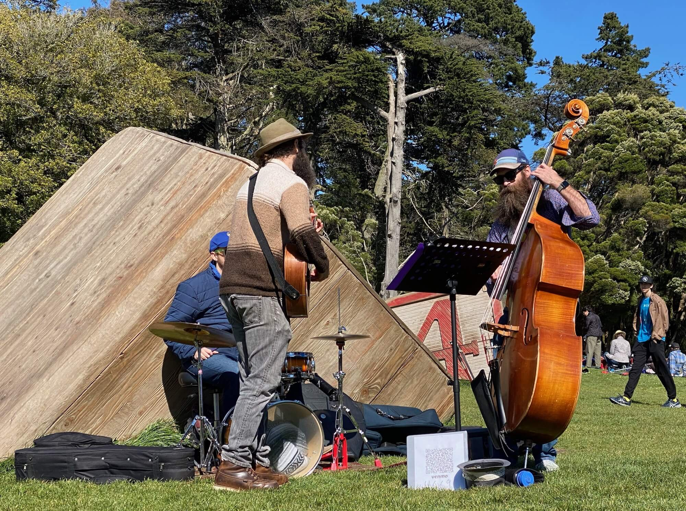

  <h2>The DKE Trio</h2>

The DKE Trio is a pre-40's jazz, blues, and popular music trio with front man singer & guitarist Daisy Dresner, bassist Kyle Finley, & drummer Eli Kemp.

Daisy's fun vibe and collection of classic early 20th century popular standards always leaves the crowd with a smile on their face and a bounce in their step!.

  
<router-link to="/music">Gigs & Jams Calendar</router-link>

  

  

Sample songs:
- Ain't Misbhavin'
- Alabama Jubilee
- Bill Bailey, Won't You Please Come Home
- Chasing Rainbows
- Deep River Blues
- Everybody Loves Me Baby
- Fox On The Run
- Hesitation Blues
- How'm I Doin'?
- I Get The Blues When It Rains
- I Can't Give You Anything But Love
- John Henry
- Keep My Skillet Good and Greasy
- Lazy Bones
- San Francisco Bay Blues
- She Lived Down By The Firehouse
- Singing In the Bathtub
- Sister Kate
- They're Red Hot
- Today's Teardrops
- Walk Right In

  <h2>Recordings</h2>
  
Here are a few live recordings for a sample of our sound.

  
Not professional recordings. Made with an iPhone sitting somewhere nearby.

  <media-player :tracks="this.$parent.dke_tracks"></media-player>

