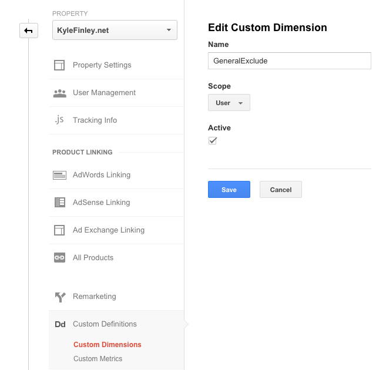
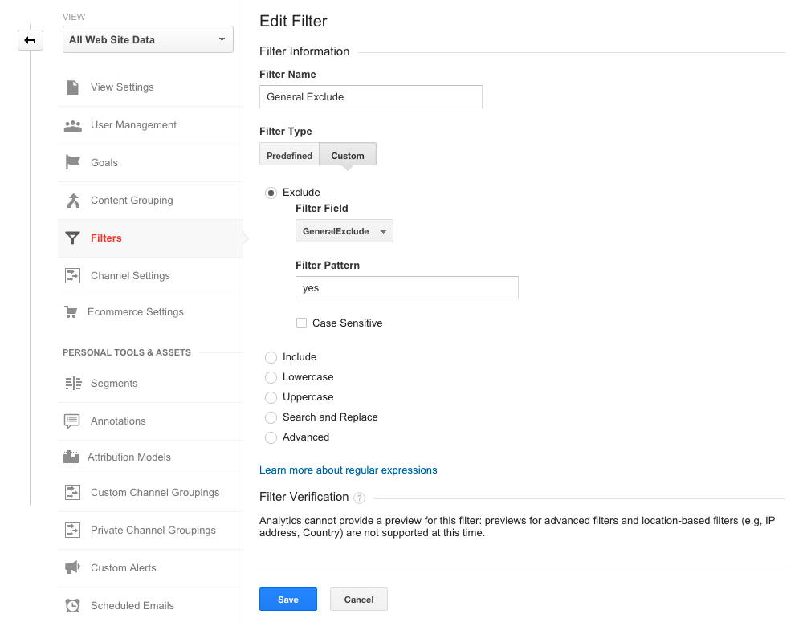
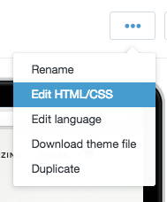

# Exclude Internal Traffic from Google Analytics for Shopify
### How to exclude traffic from Google Analytics for a Shopify store for users based on a custom Cookie. Best option for remote users with changing IP Addresses.

*<div class="article-meta-data"> by <span class="article-meta-author" itemprop="author"><a href="https://twitter.com/kfinley" target="_blank" title="kfinley on Twitter">Kyle Finley</a></span> Published: <time itemprop="pubdate" datetime="8/25/2015 4:55:46 PM">Tuesday, August 25, 2015</time></div>*

---

## Maintain Clean Analytics by Filtering Internal Traffic
---
A common issue with most websites is inflated direct traffic due to website owners or employees visiting the site on a regular basis. There are several options for how to filter traffic in Google Analytics including using the user's IP Address, Network Domain, or Custom Dimension. The simplest solution is to filter by IP Address but if you are like most nomadic workers and don't have a consistent Office or IP address this results in creating and editing filters all the time. That's a pain! A better approach is to use a Custom Dimension combined with a custom Cookie to determine if the traffic should be excluded or not.

Now let's get to it and configure this for a Shopify Store.

## Create a Custom Dimension in Google Analytics
---
First you'll create a Custom Dimension at the Property level in Google Analytics and name it "GeneralExclude" (or any other name you'd like as long as you use it consistently throughout the rest of the setup in place of GeneralExclude). ***Note the index value for the Custom Dimension after you create it. The index will be needed in the next step.***



## Create Google Analytics View Filter Based on Custom Dimension
---
Now that we have our Custom Dimension created we can create a Filter for our View using the Custom Dimension. This should be done on the View level and not the Account otherwise you won't see the new Custom Dimension you created because it's at the Property Level.



## Configure Shopify to Exclude Internal Traffic based on Cookie Value
---
Now that Google Analytics is configured we turn to Shopify and add additional Google Analytics Javascript code that will set our Custom Dimension value for internal users. In your Online Store preferences go to Settings -> Online Store and add the following code to the Script text box under Google Analytics account settings.


```javascript
var isExcluded = (r = RegExp('(^|; )' + encodeURIComponent('GeneralExclude') + '=([^;]*)').exec(document.cookie)) ? r[2] : null;
  if (isExcluded) {
      ga('set', 'dimension1', 'yes');
  }
```

What this code does is look for a cookie named "GeneralExclude" and if it exists a call is made to set the value "yes" for dimension1. When working with Custom Dimensions they are accessed by dimension index and not actual name. This is where you'll need to use the index you noted before. If you didn't have any Custom Dimensions already then you will use 'dimension1' in the script.

## Create Custom Cookie using Javascript
---
The last step needed is to create the Custom Cookie for internal users. If your store uses logins then you can create custom code that sets the cookie when users that are internal employees log into the Shopify store. This is the most transparent approach but requires both using logins for the store and writing custom code in the theme. The approach I'm going to show assumes you don't have logins enabled and we'll create a page that we can direct all internal users to visit which will set the Custom Cookie in their browser.

In your online Store preferences go to Online Store -> Pages and create a new page named "GA-Exclude"

Show the HTML for the Content by clicking on the "Show HTML" button in the editor and add the following:

```html javascript
  Your traffic will now be excluded from Google Analytics for this browser.
  <script>

    var exp = new Date();
    exp.setFullYear(exp.getFullYear() + 2);
    document.cookie = 'GeneralExclude=Used for GA Custom Dimension Exclusion of Page Views; expires=' + exp + '; path=/';
  </script>
```

This code will set a cookie that expires in 2 years with a name "GeneralExclude" and value "Used for GA Custom Dimensions Exclusion of Page Views." Leave all other settings alone and use a page template (or any other template you're theme has that you want to use).
Now everything is in place to work but we want to make sure that this page is not seen by any external users or included in any Search Indexes. If you're using a Shopify App that can exclude this page then mark it as excluded (noindex). If not we can exclude the page by modifying the theme.liquid file to add a noindex tag for the page. To do this go to Online Store -> Themes in your Online Store preferences and select "Edit HTML/CSS" from the ellipsis button.

<div style="text-align: center;">



</div>

Open the theme.liquid file from the Layout folder and add the following code inside of the tag and save the file.

```html
  
  <meta name="robots" content="noindex">
  
```

## Test & Share Page with Internal Users
---
Once you've completed the steps visit the /pages/ga-exclude page on your store and from then on your traffic will be excluded. Test your setup with Google Analytics and if all is good share the page with all internal users and you should see a drop in traffic because of the previous inflated numbers that included internal traffic.

If you have any questions or comments or see a problem with my post please let me know. You can reach me on Twitter at <a target="new" href=https://twitter.com/kfinley>@KFinley</a>.
