# Old Flatback Bass

#### Recent purchase

_
 by Kyle Finley Published: <time itemprop="pubdate" datetime="7/1/2024 ">Monday July 1, 2024</time>
_

---

I recently purchased this old flatback bass. There is no maker label or obvious markings. I suspect it's a 19th century German, Bohemian, or possible Tyrolean but I'll have to see what others say. It has had a previous major resotration done by Karl A. Munson of Monmouth, IL. This restoration was done in 1953 (written inside in multiple places next to his stamp). There's also what looks like marked with a paint brush either S-WI-III, S-UI-III (the S could be a 5).

It looks like the 1953 restoration included a lot of work including many cleats, top grafts, edge replacements, installation of new ribs on the lower bouts, and (I suspect) neck block and crack repair. The slope of the block looks like it's different than what it once was, which would make the back a little longer than originally. There's what looks like a plug on the heel of the block shown in the pictures. The crack repair looks ok. Some of the smaller cracks are only glued and taped so they may have been repaired by someone else. There seems to be only one crack that has no repairs (center seam extending up from saddle). 

Unfortunately along the way the scroll took a major whack and broke off at the base of the pegbox. It's been glued back on but the repair is subpar so this needs addressed. It has Hat Peg Machines that look like old Rubners. The nut was missing but the bass did come with the tailpiece, Spirocore strings (mediums with life left), an old Realist Copperhead pickup, and a nice old massive rolling bag (which needs some repair). The fingerboard is in great shape and feels really nice.

The bass has the following measurements:

- Body Front: (Block to bottom of Saddle): 43 7/8"
- Body Back: 44 7/8"
- Upper Bouts Back: 20"
- Upper Bouts Front: 19.5"
- Lower Bouts Back: 26"
- Lower Bouts Front: 25.5" 
- C Bouts Back: 14 1/8"
- C Bouts Front: 14" 
- C Bout Height: 9.5"
- String Length (this is a guess): 43"
- Fingerboard:  27 3/8"
- Neck (Block to Scroll): 16"
- Body Depth @ Block: 6"
- Body Depth: 8.5"
- Block Depth (back lip to fingerboard): 7 1/8"
- Scroll Heel to Fingerboard: 3.5"
- Scroll Height: 12.5"

My next steps are to get this bass in the shop and address the scroll and any other necessary issues. First I want to hear what this old beauty sounds like and go from there.

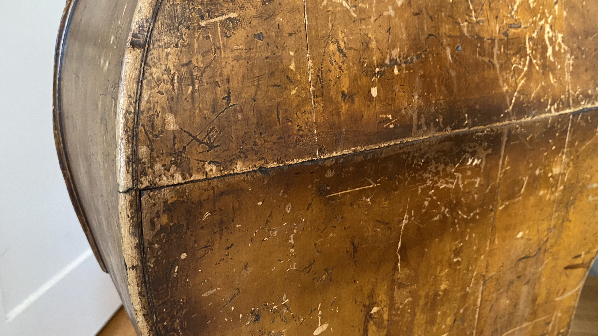

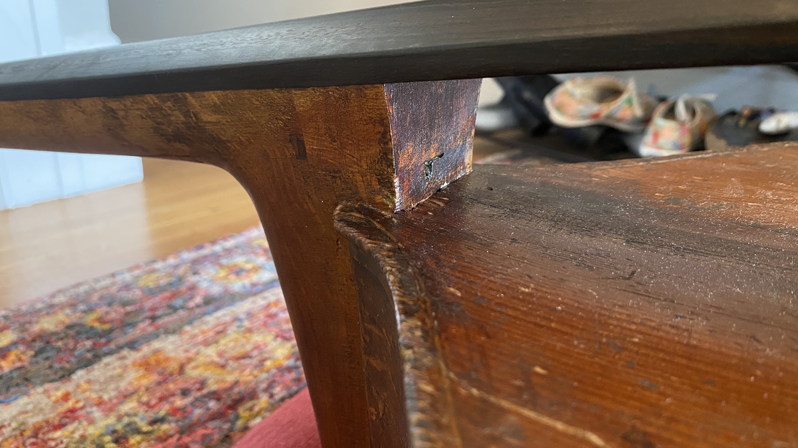
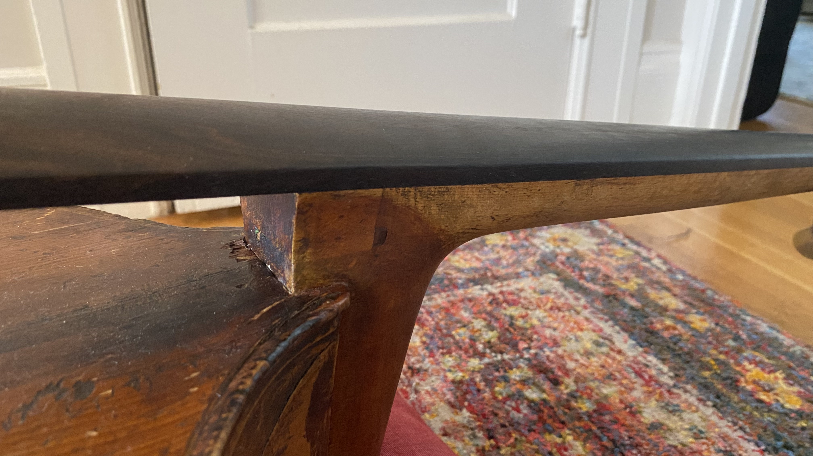
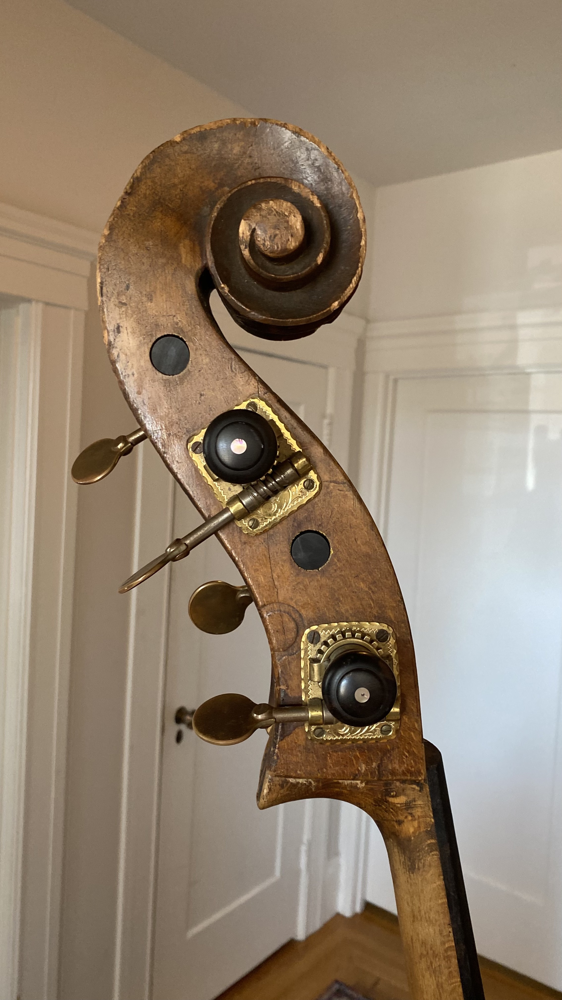
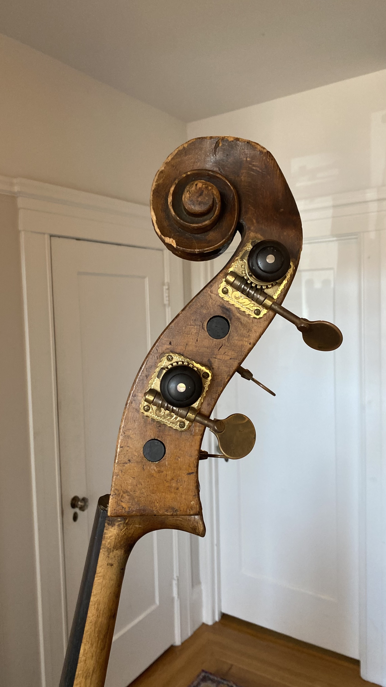
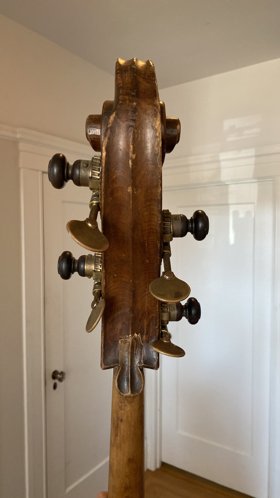
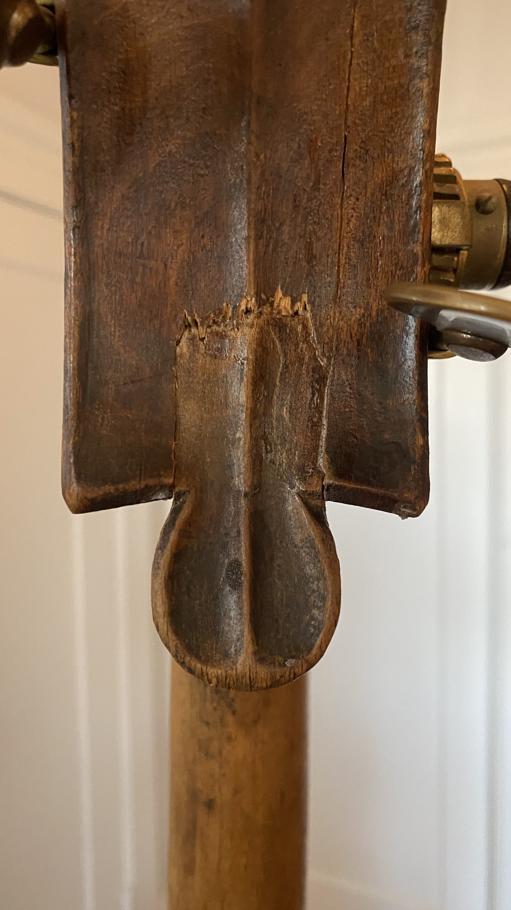
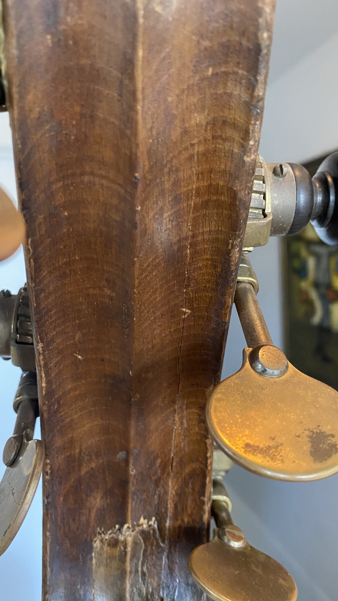
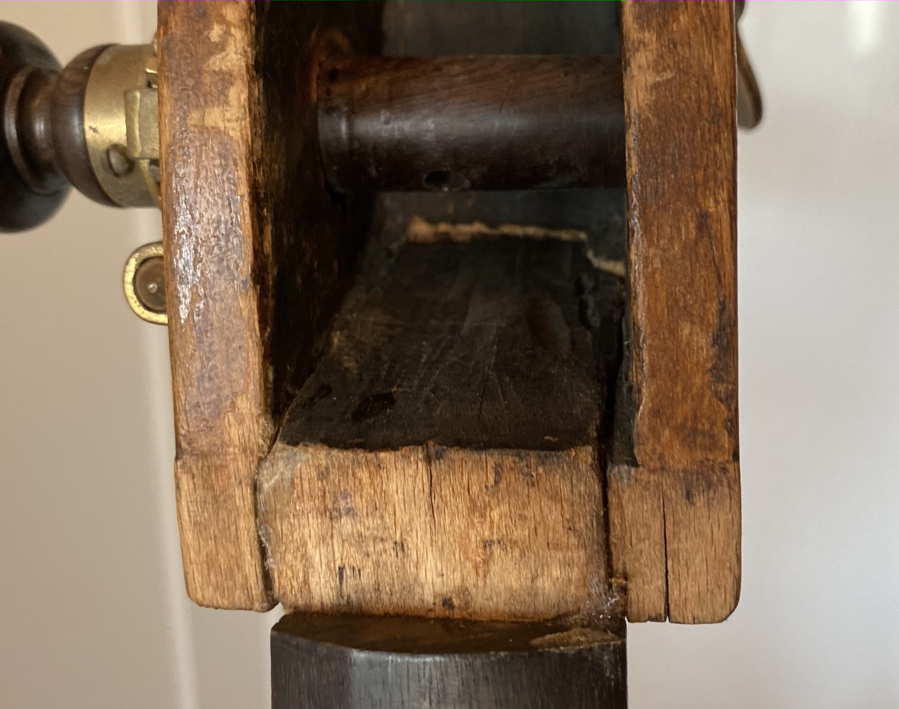
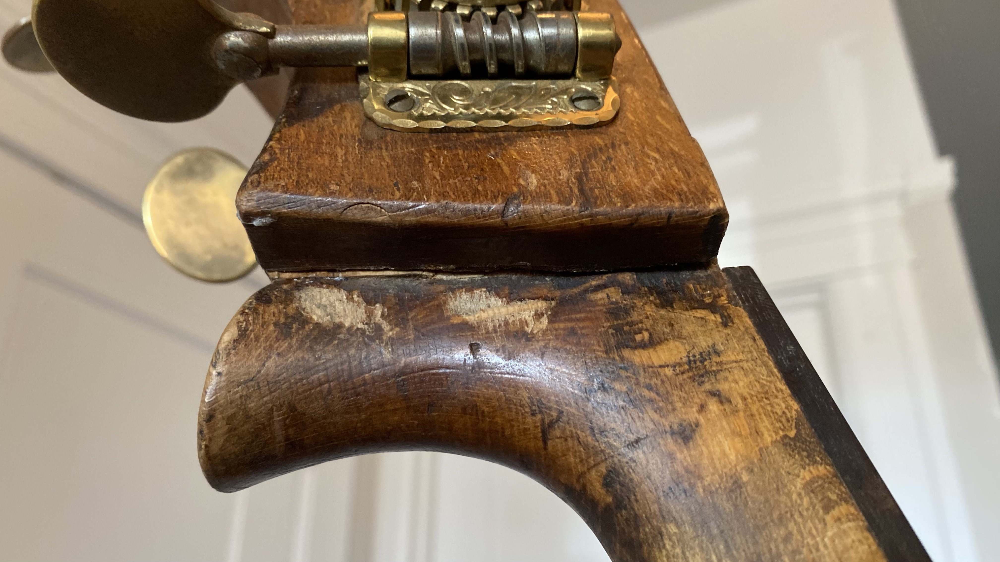
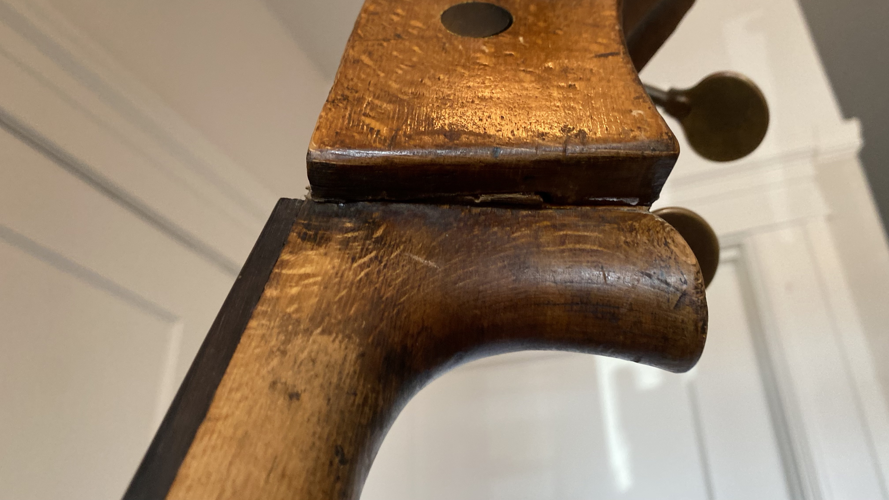

More pictures to come...
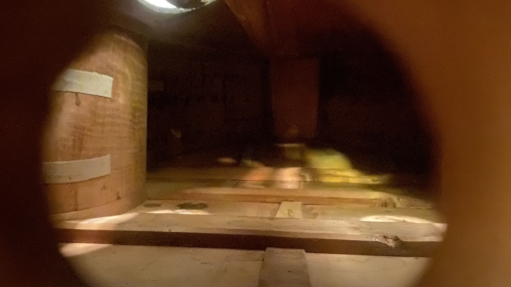
