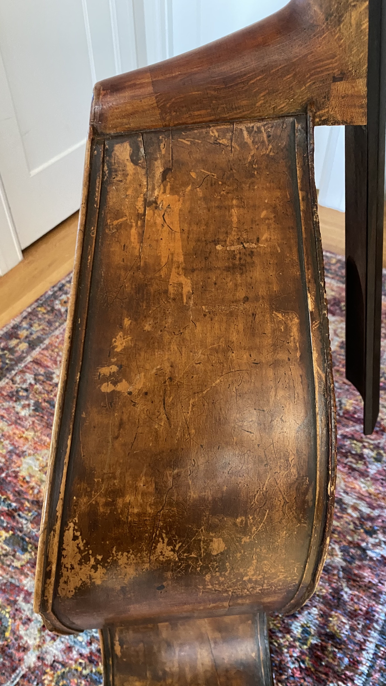
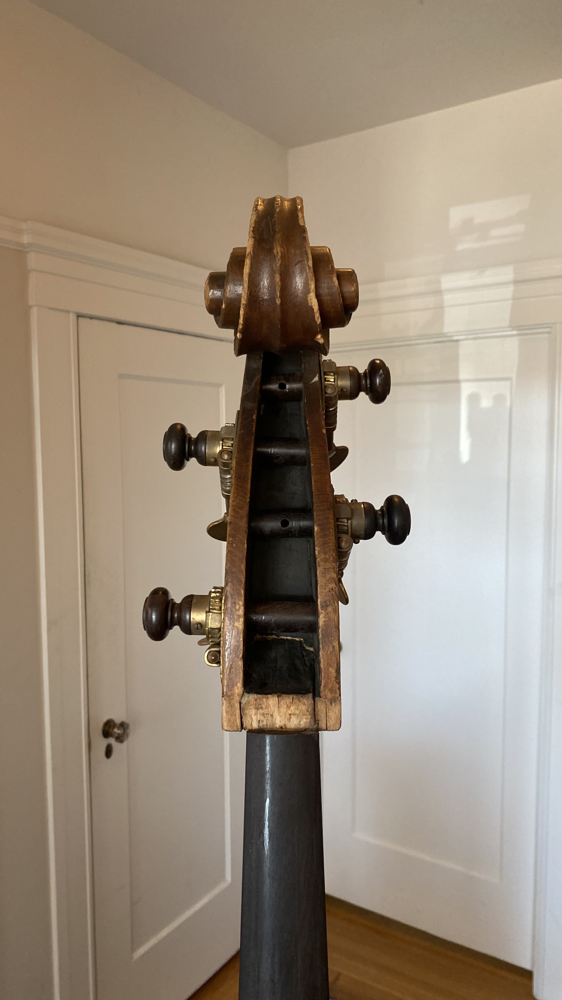

# Old Flatback Bass

#### Recent purchase

_
 by Kyle Finley Published: <time itemprop="pubdate" datetime="7/1/2024 ">Monday July 1, 2024</time>
_

---

I recently picked up an old flatback bass. There is no maker label or obvious markings inside other than repair signatures and stamps. I suspect it's a 19th century German, Bohemian, or possible Tyrolean but I'll have to see what others say. I've been told by my luthier that it's approximately 1880s and German. It's had several repairs and there's evidence the top has been off at least twice. A major resotration was clearly done by Karl A. Munson of Monmouth, IL. This restoration was in 1953 (written inside in multiple places next to his stamps). My luthier also found another stamp and signature in the center of the top under the fingerboard area. There's also what looks like marked with a paint brush either S-WI-III, S-UI-III (the S could be a 5). 

It looks like the 1953 restoration included a lot of work with many of the cracks cleated, top edges built up, edge replacements past the perfling all around, possibly installation of braces along the ribs on the lower bouts where the large cracks are, and maybe the neck block and crack repair. The slope of the block looks like it's different than what it once was, which would make the back a little longer than originally. There's what looks like a plug on the heel of the block shown in the pictures. The crack repair looks ok. Some of the smaller cracks are only reapaired with linen so they may have been repaired by someone else. There seems to be only one spot that has no repairs and is opening up a little (center seam extending up from saddle).

Unfortunately along the way the scroll was broken off at the base of the pegbox. It was glued back on but the repair was done with super and C clamp in clearly a garage style repair. This has since been redone and is solid (not photoed yet). It has modern hat-peg machines that replaced the original ones and I've confirmed with the CEO of Rubner Machines company that they are in fact Rubner Tuners from the early 90s. I suspect these were replaced when the scroll was broken. The nut was missing when I got it but it did come with a tailpiece, Spirocore strings (mediums with life left), an old Realist Copperhead pickup, and a massive rolling bag that's in rough shape. The fingerboard is very thin but plays well and I agree with my luthier that it needs to be replaced in order to provide more support for the neck. The scroll also has a string dent in it. My luthier thinks this worn in from several decades of being tied down on a wagon while traveling.

The bass is currently playable and has Evah Pirazzi Wiechs on it. I'm actively using it for select gigs with a Shertler Stat-B mic/pickup. I plan on having more work done to it in a few months as some of the crack repairs have opened up.

The neck is beach wood (orther than the block area that's been modified with maple), the top is very wide grained spruce, and I believe the sides and back are maple.

The bass has the following measurements:

- Body Front: (Block to bottom of saddle): 43 7/8"
- Body Back: 44 7/8"
- Scroll to Saddle: 75"
- Upper Bout Back: 20"
- Upper Bout Front: 19.5"
- Lower Bout Back: 26"
- Lower Bout Front: 25.5"
- C Bout Back: 14 1/8"
- C Bout Front: 14"
- C Bout Height: 9.5"
- String Length: 42.5"
- Fingerboard:  27 3/8"
- Neck (Block to scroll): 16"
- Body Depth @ Block: 6"
- Body Depth: 8.5"
- Block Depth (Back lip to fingerboard): 7 1/8"
- Scroll Heel to Fingerboard: 3.5"
- Scroll Height: 12.5"

Now that I've gotten the scroll repaired I've been able to play this old beauty on a few gigs. I can say she feels and sounds amazing!!! The bass is loud with a nice deep woody tone. Both pizz and arco sounds wonderful. I'm confident in saying it's almost on par with my 1980 Rubner but just different (for obvious reasons... flatback vs. round, solo bass vs. orchestral workhorse, etc.). The upper register just sings with every note ringing with the fundamental shining through in an almost bell like way. The few people I've let play it have said it's both a beast and amazing. After playing it for the first time a buddy yelled at me from the stage... "I'm gonna steal this bass man!!" During one of his solos he hit the G harmonic and it blew him away so much he stopped playing and just looked at me and yelled "Wow!!" He later told me he had dreams about the bass that night.

There is one crack/seam that is opening up that has no repair on it. This is the center seam above the saddle.

