# Twitter Scheduler with Images uploaded from Google Sheets
#### Twitter Scheduler that supports Native Images using Google Sheets & images stored in Google Drive via Apps Script and theTwitter API.

*<div class="article-meta-data"> by <span class="article-meta-author" itemprop="author"><a href="https://twitter.com/kfinley" target="_blank" title="kfinley on Twitter">Kyle Finley</a></span> Published: <time itemprop="pubdate" datetime="7/3/2015 6:40:00 PM">Friday, July 3, 2015</time></div>*

---

## Free Yourself from Twitter with a simple Twitter Scheduler!
---

If you're serious about Social Media then you probably already use some type of scheduling to handle some of your status updates. For years I've used [Hootsuite](http://hootsuite.com/) for scheduling status updates but it doesn't really do what I want. What I'd rather have is a scheduling option based on Google Sheets so I can easily manage social media posts alongside my other Google Sheets based SEO and marketing tools and reports. Here are my requirements for what I'd like in a social media scheduler:

- Status updates pulled from Google Sheets
- Post status updates based on a schedule
- Maintain URLs without additional short URL services
- Maintain @'s within status update
- Allow all legal characters in status update
- Upload native images (pics.twitter.com)
- Images sourced from Google Drive

Since I couldn't find anything that met these requirements I built this Google Spreadsheet based Twitter Scheduler.

## Background
---
It's hard pressed to find a free option that covers all that but I'm always keeping my eye open for for something that'll work, unfortunately I've never really found anything. If you know of something feel free to let me know at [@KFinley](https://twitter.com/kfinley). I've dabbled with a few programmatic options to handle this but I've never stuck with them to get them to work like I want and have relied on tools for scheduling. When I saw [Stefan Persson's](https://twitter.com/stefanpersson) post [100% Free Social Media Post Scheduling Growth Hack](https://instefinitely.wordpress.com/2015/04/07/build-a-social-media-post-scheduler-for-free-with-0-coding) I was intrigued. While it does cover most requirements it still has some issues. The biggest issue is it relies on [Yahoo Pipes which is shutting down this year](http://pipes.yqlblog.net/post/120705592639/pipes-end-of-life-announcement) and he uses Buffer which doesn't allow for RSS feeds with the free version. Bummer...

This at least gave me a bit of a spark to push me to see if I could come up with another option that would work using Stefan's approach but removing Yahoo Pipes for the RSS feed generation. I decided to try using Google Sites and Apps Script to populate a page with Announcements using Time Based Triggers as the scheduling mechanism. When the trigger fires Tweets are pulled from the Google Sheet and posted to Twitter. While working on the setup I hit a snag with the Hootsuite RSS feed. Unfortunately unlike Buffer, Hootsuite doesn't allow you to flow the title through as the Tweet content and instead appends a shortened URL using Ow.ly (or one of their other shortner services that you select in the "URL shortener for links" option in the RRS setup).

<div style="text-align: center;">

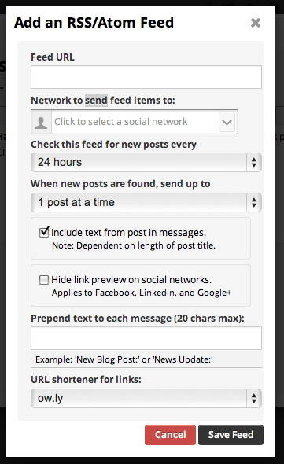

</div>

So Hootsuite is out. See ya!! I tried another scheduler, Twitterfeed.com, and it does indeed give the option to set what is used as the content (title only, description, and title & description). Twitterfeed also gives you the option to include a link or not, and the option to use a variety of URL shortners (as well as using your own). They also let you set the Update Frequency and control how many posts to update when the schedule runs.

<div style="text-align: center;">

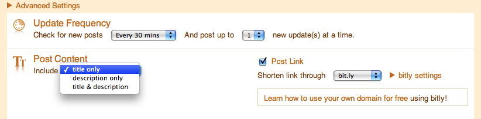

</div>

I got the setup to work but I wasn't that happy with it for several reasons:

- All new tweets found would post at the Same Time. This looks unnatural and lowers engagement and increases unfollows
- No native image upload support

Before I even finished the setup I'd already decided this wasn't going to work and the best option was to just to straight to the Twitter API from the Google Sheet using Apps Script. This works great!
There is only one issue with the script as it's written. The scheduler mechanism is handled using Apps Script Triggers. The script is written with the expectation that the process will run every 15 min. What this means is that when scheduling is enabled then every 15 minutes a process will run and look at the sheet for any tweets that need to go out between the time the process is triggered plus 15 min. This results in tweets going out around the time you have specified. For me this was good enough so I'm OK with it.

When the script finds more than one tweet in a 15 min range instead of sending them all out at once there is a 1 min delay between tweets. This gives a more natural flow in the Twitter Timeline.

And now enough talking and let's get to it! Here are the steps you need to get this working for yourself.

## Steps to Configure your own Twitter Scheduler in Google Sheets
---
#### **Step 1 - Google Spreadsheet**

Make a copy of [This Google Sheet](https://docs.google.com/spreadsheets/d/1HK_IWj2vBUuMk9V50PXZkSD4HLbqNQAi4AMsmHy_v7Y/copy) and save it somewhere on your Google Drive.

#### **Step 2 - Create an App in Twitter Apps**

Note: You must have a phone number set on your account to create an app. You'll get an error if you don't with a link explaining how to set the phone number on your account.

Go to [apps.twitter.com](https://apps.twitter.com/) and create a new app. Name it what ever you want. Use your website for the Website setting and not mine! For the Callback URL use the following URL:

```https://script.google.com/macros/d/<YOUR PROJECT KEY HERE>/usercallback```

Replacing ```<YOUR PROJECT KEY HERE>``` with the Script Project Key from the Setup Sheet in the Google Spreadsheet you copied in Step 1.

<div style="text-align: center;">

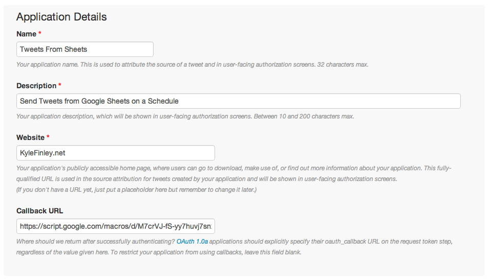

</div>

#### **Step 3 - Create Access Token**

Go to the Keys and Access Tokens tab in the App you just created and click the generate an Access Token to connect from the Google Sheet with.

<div style="text-align: center;">

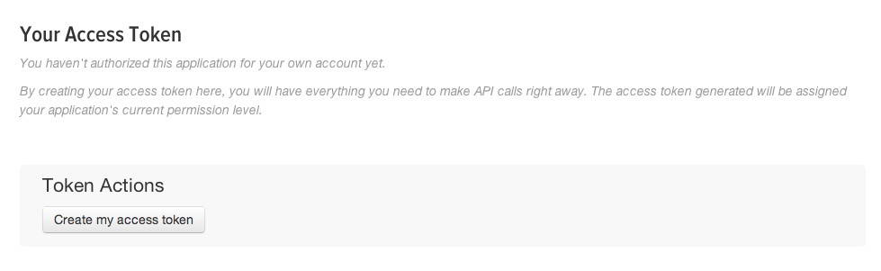

</div>

Once you've created the Access Token copy the following values to the Settings tab of the Google Sheet you created in Step 1.

- Consumer Key (API Key)
- Consumer Secret (API Secret)
- Access Token
- Access Token Secret

#### **Step 4 - Close the Script Editor and Reload the Sheet in the browser**

Once you reload you should see a new tab called "Scheduler" has been added.

#### **Step 5 - Authorize Script with Twitter App**

The Apps Script code that runs you'll need to grant Authorization. Select "Authorize Script" from the Scheduler menu and you'll get a message saying that Authorization is Required.

<div style="text-align: center;">

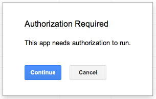

</div>

Then Click Accept on the list of things the Script will need to authorize.


<div style="text-align: center;">

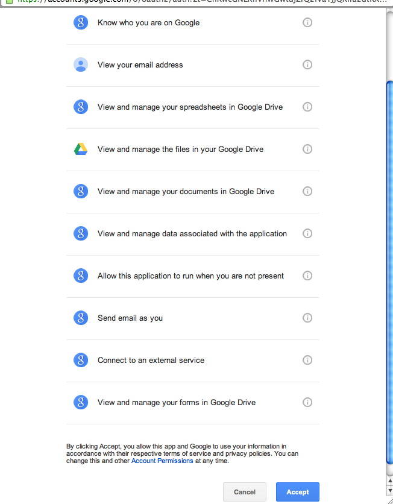

</div>

#### **Step 6 - Send a Test Tweet**

At this point we can test that the sheet is authorized to sent Tweets. Select "Send a Test Tweet" from the Scheduler Menu and look at your Twitter account to confirm the Tweet was sent.

<div style="text-align: center;">

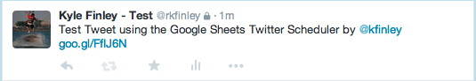

</div>

#### **Step 7 - Enable Google Shortener API**

In order for the Google URL Shortener to work you'll need to enable the URL Shortener API in Google Developers Console for the project. You can get there by selecting "Script Editor" editor from the Tools menu.

<div style="text-align: center;">

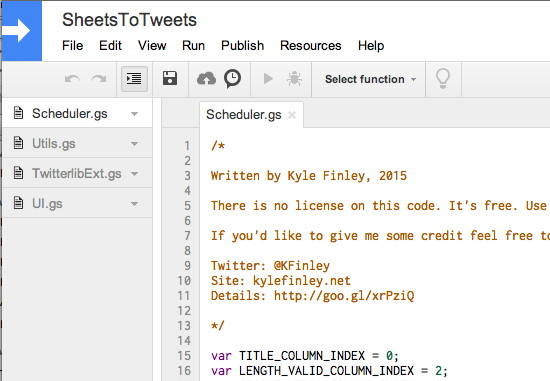

</div>

Once you're in the Script Editor select "Developers Console Project" from the Resources menu.

<div style="text-align: center;">

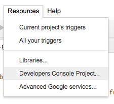

</div>

Once you're in the Developers Console click on "Enable Google APIs for use in your apps" on the Home screen. This will bring up the list of Google APIs.

<div style="text-align: center;">

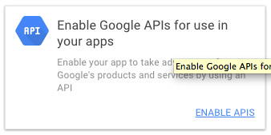

</div>

Select URL Shortener API from the Other popular APIs list.

<div style="text-align: center;">

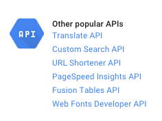

</div>

Now click Enable API.

<div style="text-align: center;">

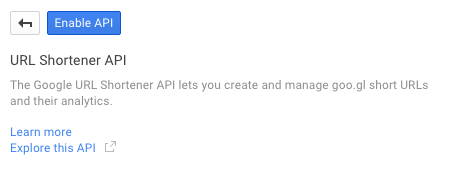

</div>

#### **Step 8 - Scheduling Tweets**

To schedule tweets you simply put the content you want to be posted into the Twitter tab in the Sheet. There are several columns and a few formulas that are setup to help with scheduling.

The columns you'll be using for posting are:

- Content
- Url
- Google Media IDs
- Publish Date

Content and Publish Date are pretty straight forward and obvious. Content is the content of the tweet and Publish Date is when it should be posted. Publish Date needs to include the specific time such as "1/1/2015 7:00:00."

The Url column is optional and if used will use Goo.gl URL Shortener Service to create a short URL to be included in the Content of the Tweet. Use the token {Url} in the Tweet text where you want the Url. If the {Ur} token is included and no URL provided then you'll get an error in the length column. An error will also be reported for the inverse, providing a URL with no {Url} token.

The Google Media IDs column is for a list of Google Image IDs for images to be uploaded with the tweet separated with carriage returns (ctrl-return). You get this ID by opening up the image you want to include in Google Drive and looking at the URL. You should have a URL similar to the following:

<div style="text-align: center;">

https://drive.google.com/file/d/0BzCdyDpwFTdJRnY1dTc2bDZXUWc/view

</div>

The ID is the number between /file/ and /view. In this example the ID is 0BzCdyDpwFTdJRnY1dTc2bDZXUWc.

Something to remember is that when you click on an image in Google Drive you get a preview of the image but the URL does not show the Image ID. You'll need to open the image in it's own tab by using the "Pop-out" option in the upper right hand corner of the page. It's the one in the center in the image below.

<div style="text-align: center;">

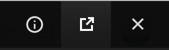

</div>

You can include up to 4 images for a Tweet. Each should be followed by a return and on it's on line within the cell. Here's an example of 4 images for a scheduled tweet

<div style="text-align: center;">

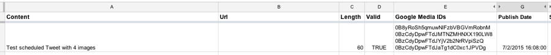

</div>

*Additional Columns & Formulas*

The sheet has a few more column including 3 hidden ones.

Length Column: This column shows you how long the final Tweet Content will be. There is a custom function that calculates the length of the final tweet if it includes a URL or images. There is custom formatting that will change cell background to yellow if you've exceeded 140 characters for a tweet or there's a validation error. The error will be reported in the Length cell if there is one.

<div style="text-align: center;">

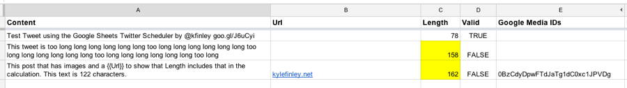

</div>

Column D is hidden and contains a field used for conditional formatting of the Length column. There is a custom function that determines if the post is valid or not. This column has the following formula:

```
=if(len(A142) > 0,isPostValid(A142, B142, E142, C142), "")
```

Column F is hidden and will have the Twitter Media ID for any successful image uploads.

Column H is hidden and will have the Twitter Status ID for any successful posts.

#### **Step 9 - Start Scheduler**

Scheduling is handled by triggers set on the Apps Script project. The Settings sheet has a selection for the Schedule Interval with a default set to run every to 15 minutes. You may be able to run the script at a smaller interval than 15 minutes but you may run up against quota limit errors.

You control the schedular by selecting Start or Stop Scheduler in the Schedular menu.

<div style="text-align: center;">

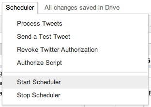

</div>

***Note on the scheduler:*** Keep in mind that status updates will not run for any dates in the past. So keep that in mind while adding new tweets to the list. If you add them at a time that's in the future but inside the current range that has run for the scheduler than your Tweets won't send. For instance if you have the scheduler set to run every 30 minutes and it runs at 3:30 and you're adding an item at 3:50 to go out at 3:55 then the message won't get picked up because the next trigger will run at 4:00. Basically always schedule something for at least as far in the future as you have your schedule configured to run at.

***Time Zones*** The sheet is set to Eastern Time Zone. You'll need to change the Apps Script Properties and set your time zone to get the correct times scheduled.

<div style="text-align: center;">

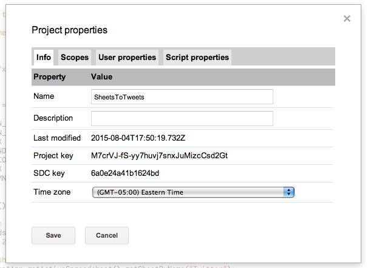

</div>

#### **Step 10 - Configure Failure Notification Email Settings (optional)**

When the trigger is created for the schedule the Execution failure notifications email is set for a daily summary at midnight. If you'd like to be alerted immediately when there's an error you'll have to change the setting. Unfortunately Google doesn't allow us to programmatically change this so you'll have to do it yourself. Follow these steps.

1. Open the Script Editor from the Tools menu
2. Open the Current Triggers by clicking the clock looking thing in the menu bar

<div style="text-align: center;">

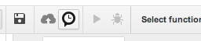

</div>

3. Click the notifications link and change time the notification is sent from Daily to Immediately

<div style="text-align: center;">

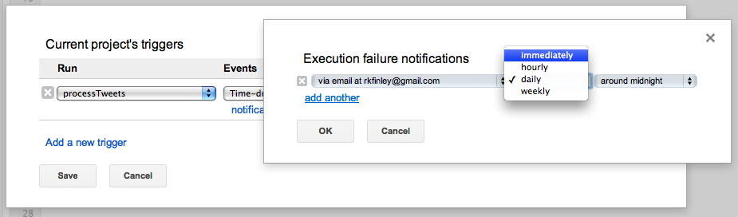

</div>

That's it!! You're all done!!

Now schedule some Tweets and make sure the script works.

### **Summary**
---
If you made it this far hopefully you're now setup with a Google Sheet that will send Images with updates to Twitter. If you'd like to see some more detail on the script code that drives the scheduler you can [read about it here](/sheets-to-tweets-script). I encourage you to take a look at the code and extend it to fit your needs. Learn Apps Script, it's worth it!

In researching this I came across a few publicly maintained Twitter Bot sheets that I looked at to understand how they did things in order to write this solution. As you can imagine by now this code will allow you to create your own Twitter Bot but remember play nice or Twitter will boot you.

As I'm sure you can imagine this code is really just the starting point of what you can do. You can build on this script or include it in your existing Sheets toolkit.

I'd love to hear comments or thoughts so please feel free to comment by tweeting to me at [@KFinley](https://twitter.com/kfinley).

- UPDATE: 7/6/2015 - Removed a few steps from the process to make this simpler. Now only 9 steps!
- UPDATE: 8/4/2015 - Added support for shortening URLs using the Google Shortener service.
- UPDATE: 9/3/2015 - Added steps for enabling URL Shortener API in Google Developers Console.
