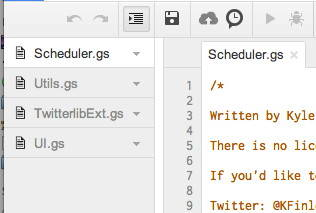

# Sheets to Tweets Apps Script Details
#### Details on the Apps Script that runs behind the Sheets To Tweets Google Spreadsheet based Twitter Scheduler.

*<div class="article-meta-data"> by <span class="article-meta-author" itemprop="author"><a href="https://twitter.com/kfinley" target="_blank" title="kfinley on Twitter">Kyle Finley</a></span> Published: <time itemprop="pubdate" datetime="7/3/2015 11:24:00 PM">Friday, July 3, 2015</time></div>*

---

To simplify the original post and to make steps a little simpler I'm moving the details on the Apps Script that runs behind the [Sheets to Tweets Twitter Scheduler](http://kylefinley.net/schedule-tweets-with-images-from-google-sheets) to this post.

The script relies on one external LIbrary, Twitter Lib. Twitter Lib is a Google Apps Script maintained by [Bradley Momberg](https://twitter.com/air_hadoken). I originally started by writing all the calls to Twitter myself but I ran into a few bugs and decided to leverage something that already works instead of trying to recreate the wheel. It's always best to use someone's code that is maintained if you can and then extend it if needed. I ended up doing some very minor extensions to Twitter Lib which I talk about below.

Here's a great post from Bradley on the the [latest version of Twitter Lib](http://airhadoken.github.io/2015/06/29/twitter-lib-explained.html) released 6/29/2015.

Here's the Google Scripts page for Twitter Lib.

The project has 4 script files included. 

<div style="text-align: center;">



</div/>

### UI.gs

This file contains code to handle interaction with the Google Sheets UI.

### Utils.gs

This file contains utility methods used in the project.

### TwitterlibExt.gs

This file contains overloads to the Twitter lib sendTweet and uploadMedia methods. I modified the behavior slightly in order to handle error messaging in the Sheet a little better.

### Scheduler.gs

This file contains the main logic of the script. There are 2 main methods in this script that I'll cover here.

```javascript
getTwitterService()
```

This method setups up the Twitter API call based on the settings in the Settings sheet using Twitter Lib and returns a reference to the service.

```javascript
processTweets()
```

This is the method that gets called when the scheduler runs. Here is the basic logic:

1. Open the Twitter Sheet
2. Get all tweets between Now and Now plus the time set for Schedule Interval (i.e. 15 Minutes)
3. If multiple Tweets are being sent in this cycle, and this isn't the first Tweet in the cycle, delay sending Tweet for 1 min and update Status to Pending.
4. Upload any Images for the Tweet and store the Media IDs.
5. Upload the Status Update using any Media IDs created and store the Tweet ID and any Media IDs in the sheet.
6. Update sheet with status with Posted or Failed and report the time posted or error.
