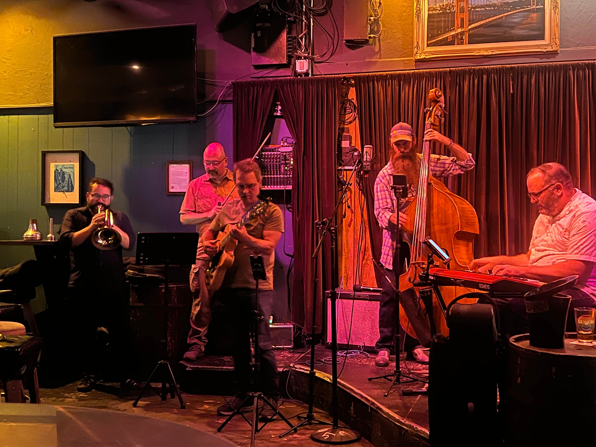
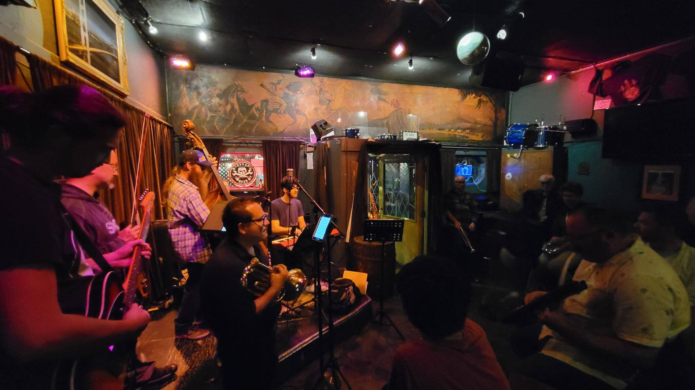

  <h2>Shoe Jazz Jam</h2>

This jam is every 3rd Wednesday of the month from 8 - 11pm. I've been hosting the <a href="https://www.theluckyhorseshoebar.com/" target="Shoe">Lucky Horseshoe</a> Jazz Jam since March 2023. This is an open jam where we pack the stage with as many players as we can and play a wide range jazz standards.

We're open to all instruments and singers. If you're going to sing please know what key you want us to play in and have confidence that you can sing with a group on stage (this isn't karaoke or speak-singing session).

The house band is usually the <router-link to="/dirty-works">Dirty Works Jazz Band</router-link> and there will always be drums and a guitar amp on the set so no need to bring those. Keys are usually there as well. Contact me if you have any questions about equipment.

  
<h5>$1 off drinks for all players!</h5>

  
<router-link to="/music">Gigs & Jams Calendar</router-link>

  <h2>Recordings</h2>
  
Here some raw recordings of the Shoe Jazz Jams.

  
These are not professional recordings. Made with an iPhone sitting somewhere nearby.

<media-player :tracks="this.$parent.shoe_tracks"></media-player>

