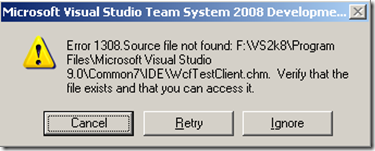

# Slipstream Visual Studio 2008 Service Pack 1
#### Step by Step guide for how to slipstream Visual Studio 2008 Service Pack 1.

*
 by <a href="https://twitter.com/kfinley" target="_blank" title="kfinley on Twitter">Kyle Finley</a> Published: <time itemprop="pubdate" datetime="4/3/2009 8:26:00 PM">Friday, April 3, 2009</time>
*

---

During the rebuild of my development environment I wanted to use the same trick I used before to reduce the size of my chained differenced VHD files.  (For info on my setup check out [Andrew Connell's](http://www.andrewconnell.com/blog/Default.aspx) [HOWTO: Use Virtual PC's Differencing Disks to your Advantage](http://www.andrewconnell.com/blog/articles/UseVirtualPCsDifferencingDisksToYourAdvantage.aspx) post.)  I haven't had time to dive into this so I did a quick search to see if there would be any issues, unfortunately there is.

According to [Heath Stewart](http://blogs.msdn.com/heaths/) slipstreaming Visual Studio 2008 sp1 is [not supported](http://social.msdn.microsoft.com/forums/en-us/vssetup/thread/987ed5a4-7392-4077-8090-4fafc26c9fa3?prof=required&lc=1033) except for Active Directory deployments.  Heath's recommendation is to perform an chained unattended install of VS 2k8 and SP1. If you're interested in this approach [here is info](http://blogs.msdn.com/astebner/archive/2006/05/04/590387.aspx) on how to do this with VS 2k5, steps for VS 2k8 should be very similar.  This would allow you to silently install both Visual Studio and sp1 on a machine.  To address the disk space requirements for installing sp1 Heath recommends you disable the patch baseline cache using the [MaxPatchCacheSize](http://msdn.microsoft.com/en-us/library/aa369798(VS.85).aspx) policy.  No doubt this option will work but it isn't exactly what I wanted.  Also keep in mind there could be issues using this approach, if you need to repair or uninstall a patch you will be [prompted for the source](http://blogs.msdn.com/heaths/archive/2005/12/02/499495.aspx) files, which you won't have. Since the forum post implied that an AD deployment of a slipstreamed install is supported I assumed this would still be possible so I wanted to give it a go.

As a starting point I looked back at [Richard Rudek's](http://richardrudek.spaces.live.com/blog/) post on [slipstreaming Visual Studio 2005 SP1](http://richardrudek.spaces.live.com/blog/cns!8B65F3DE0BE797AA!185.entry).  As I expected the steps are just about the same but I ran into a little bit of a snag.  Creating the Administrative installation of VS was no problem.  When I applied the service pack to the admin install I received the following error.

A quick Google search led me to the [Bug](https://connect.microsoft.com/VisualStudio/feedback/ViewFeedback.aspx?FeedbackID=362252).  Unfortunately the status for the bug is Closed (Won't Fix).  I searched the install folder for the WcfTestClient.chm file and found it in a different folder than where the service pack installer expected it to be, instead the file was in the Program Files\Microsoft Visual Studio 9.0\Common7\1033 folder.  To get around the error I simply copied the WcfTestClient.chm file from the Program Files\Microsoft Visual Studio 9.0\Common7\1033 folder to the Program Files\Microsoft Visual Studio 9.0\Common7\IDE folder and reran the service pack installer.  This time it ran with no errors!  Next finished out the steps in Richard's post (Step 4).  There were much more than 7 files prompted for overwriting, I didn't count the files but just hit N each time I was prompted.  Once the files finished copying I installed the slipstreamed Visual Studio installation on a fresh vm and it installed with no errors.  I checked the SP level of Visual Studio and it showed to be sp1.

Here ere are the commands I ran for each step:

#### Step 1
`msiexec.exe /a E:\vs_setup.msi TARGETDIR=F:\VS2k8 /L*vx F:\VS2k8\vsinstall.log`

(Note: Copy WcfTestClient.chm file before running step 2)

#### Step 2
`VS90sp1-KB945140-ENU.exe /extract F:\VS2k8SP1\Extracted`

#### Step 3
`msiexec.exe /a F:\VS2k8\vs_setup.msi /p F:\VS2k8SP1\Extracted\VS90sp1-KB945140-X86-ENU.msp /L*vx F:\VS2k8\patch.log`

#### Step 4
`xcopy E: /h /i /r /s /exclude:exclude.txt`

Once completed the slipstreamed installation folder is 4,490,358,390 bytes and contains 14,966 files with 1,543 folders.

Hope this helps.

Cheers,
Kyle

### Comments (closed)
---

## re: Slipstream Visual Studio 2008 Service Pack 1
*Wednesday, April 08, 2009 9:12 AM by Jiucenglou*

Great article!

Could you please tell how to reorganize the files into *.cab formats after the slipstreaming?

---

## re: Slipstream Visual Studio 2008 Service Pack 1
*Thursday, April 09, 2009 7:43 AM by Cassius*

Clear manual.

But I cannot make step 3 because VS90sp1-KB945140-X86-ENU.msp doesn't exist in my extraction.

The VS90sp1-KB945140-ENU.exe is only 536 kB and when I normally execute it it start downloading (the rest??) from the microsoft site. I also tried to download the iso file but that gives a total different file tree to use for slip streaming.

---

## re: Slipstream Visual Studio 2008 Service Pack 1
*Sunday, April 12, 2009 7:55 PM by softwerx*

I'm in the final process of creating the slipstreamed install media. I, like Cassius, had downloaded the ISO and gotten a different file tree and the same issue as he. After looking at the folder structure, where I extracted the ISO contents to, I noticed that the actual files were in a folder named vs90sp1. I added that directory to the path (where appropriate) in step 3 and everything has - so far - gone off without a hitch.

Excellent work Kyle.

---

re: Slipstream Visual Studio 2008 Service Pack 1
*Thursday, April 15, 2010 11:22 AM by Chris*

I followed this pretty much step by step and worked absolutly perfectly.

nicely done.
