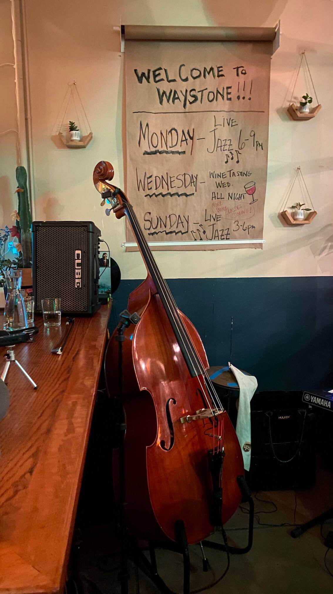
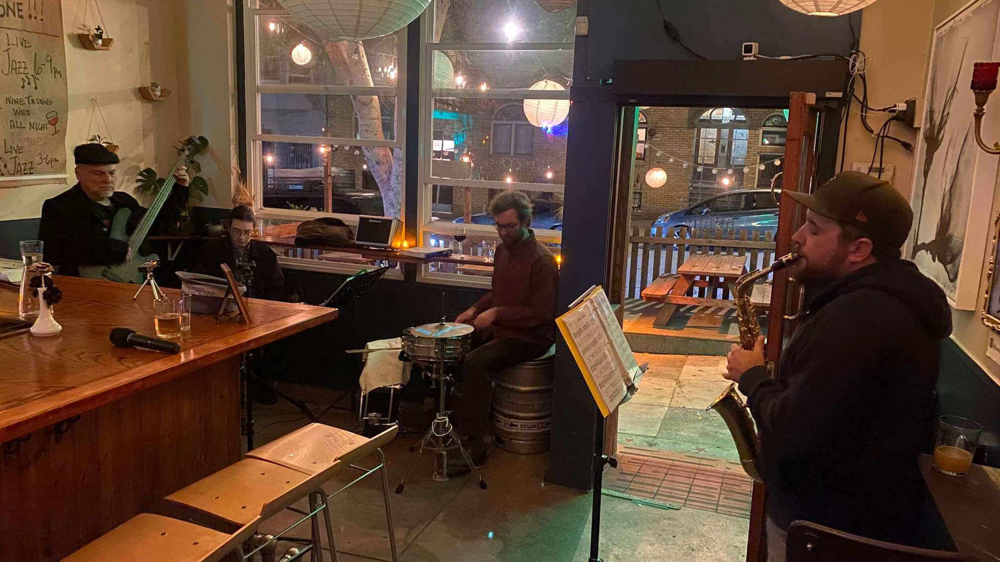

  <h2>Waystone Monday Night Jazz Jam</h2>

Monday nights from 6-9pm I host a jazz jam at the <a href="https://waystonesf.com" target="waystone">Waystone Wine Bar</a> in the North Beach neighborhood of SF. This is a very casual jam usually featuring Dan Dectis on alto sax, Richard Cacares on keys, Peter Ilf on trumpet, Eli Kemp on drums, and myself on bass.

We play classic jazz standards and usually have a handful of players show up through the night. This is a pretty fresh jam that started the first week of Nov 2023. We're just getting started and so far it's been a blast!!

Big thanks to Tom from <a href="https://waystonesf.com" target="waystone">WaystoneSF</a> for letting us bring jazz into the bar every Monday night!! We're always open to more players and singers are very welcome. If you have any questions feel free to reach out via <a href="mailto:kyle@kylefinley.net">email</a>.

  

  <h5>Next Jam   November 27th</h5>
  The house band will be featuring Daisy Dresden on guitar and vocals with his renditions of pre-40's jazz & blues.
  

  

  <h5>$1 off drinks for all players!</h5>
  Just let Matt, the bartender, know you're playing in the jam when you order
  

  
<router-link to="/music">Gigs & Jams Calendar</router-link>

  <h2>Recordings</h2>
  
Here some raw recordings of the sessions.

  
These are not professional recordings. Made with an iPhone sitting somewhere nearby.

<media-player :tracks="this.$parent.waystone_tracks"></media-player>

