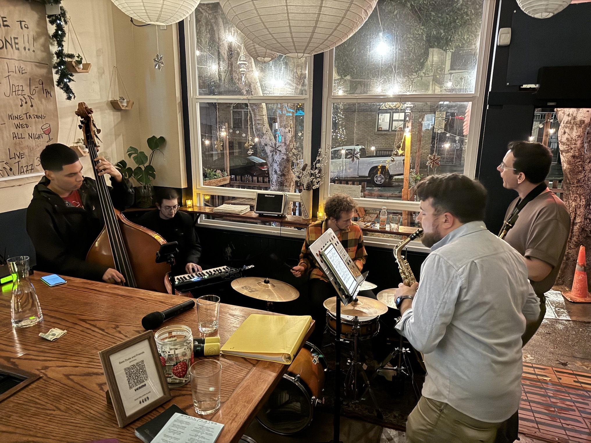
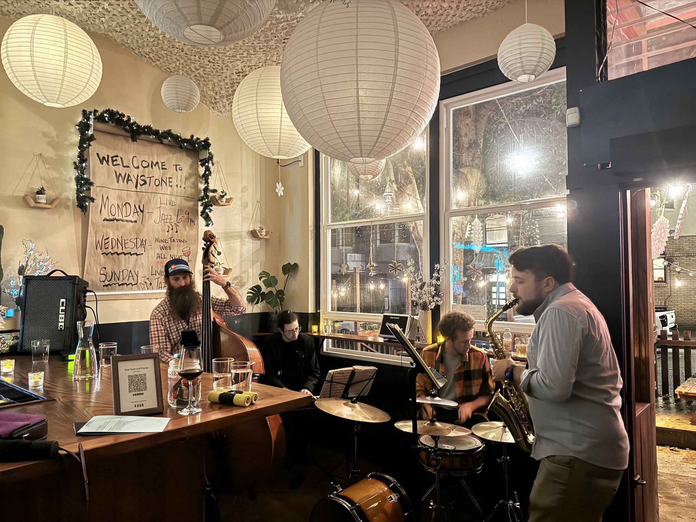
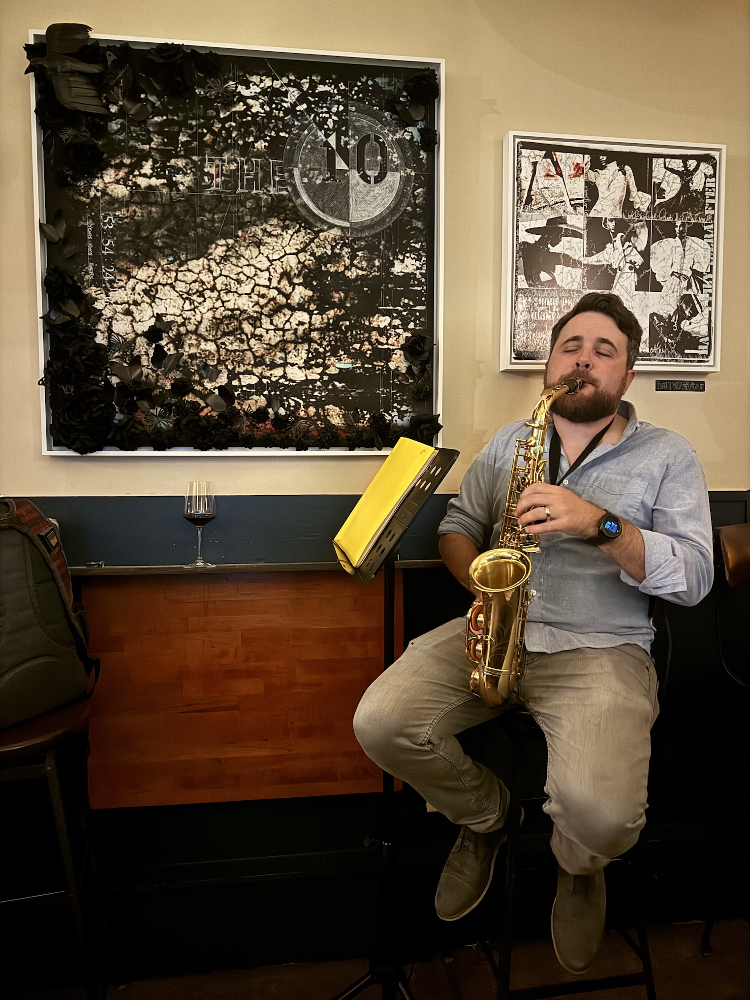
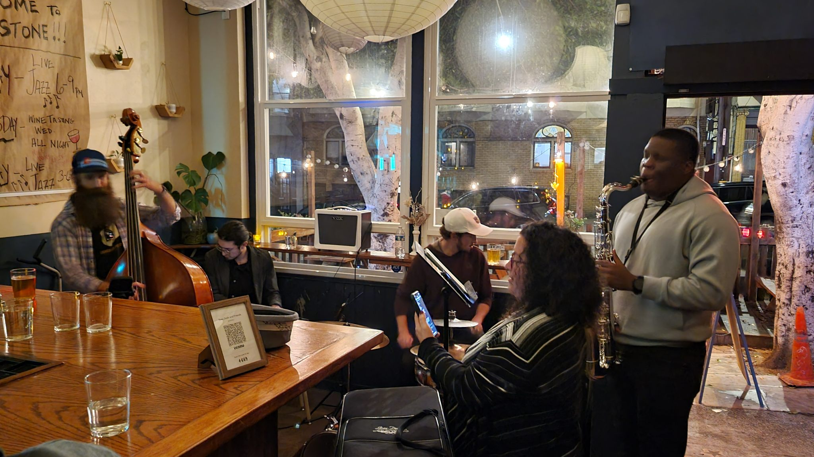
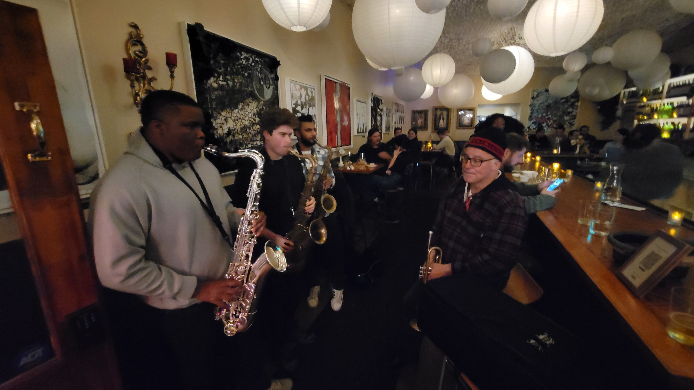

  <h2>Waystone Monday Night Jazz Jam</h2>

Monday nights from 6-9pm the <router-link to="/dirty-works">Dirty Works Jazz Band</router-link> hosts an open jazz jam with at the <a href="https://waystonesf.com" target="waystone">Waystone Wine Bar</a> in the SF North Beach neighborhood.

We play classic jazz standards. We usually have a 10 to 20 players show up through the night. The format is pretty open. 3 horns per tune. Come up and play anytime from the start.

Big thanks to Tom from <a href="https://waystonesf.com" target="waystone">Waystone</a> for letting us bring jazz into the bar every Monday night!! We're always open to more players and singers are very welcome. If you have any questions feel free to reach out via <a href="mailto:kyle@kylefinley.net">email</a>.

  
<router-link to="/music">Gigs & Jams Calendar</router-link>

  <h2>Recordings</h2>
  
Here some raw recordings of the sessions.

  
These are not professional recordings. Made with an iPhone sitting near the bass.

<media-player :tracks="this.$parent.waystone_tracks"></media-player>

